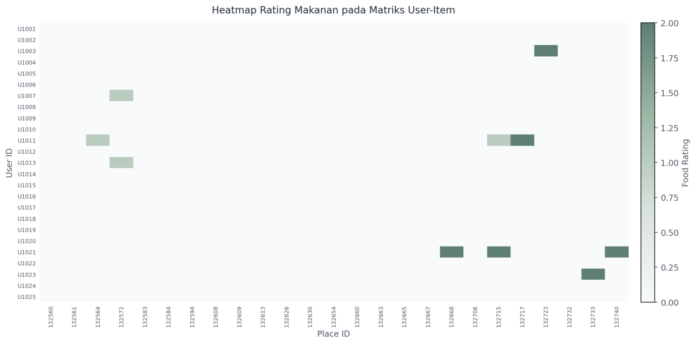

# Least Squares Food Recommendation

This project builds a simple food recommendation system using a least squares model. It analyzes restaurant and user preference data to predict food recommendations based on available ratings and cuisine information.

## Project Overview

- Dataset includes restaurant details, cuisine types, user profiles, payment options, and ratings.
- The model is implemented in `src_code/least_squares_model.py`.
- Results are saved to `src_code/hasil_rekomendasi.csv`.

## How It Works

1. Load and preprocess restaurant and user data from the `dataset/` folder.
2. Train a least squares model using rating data.
3. Generate personalized restaurant recommendations.

## Visualization

The repository includes visualizations showing key data patterns and model results.

- **Bar Chart**: compares recommendation results or rating distributions.
- **Heatmap**: visualizes correlations or user-item interactions.

## Files

- `dataset/`: raw data files used for recommendation modeling.
- `src_code/least_squares_model.py`: main script for building the model.
- `src_code/hasil_rekomendasi.csv`: generated recommendation results.
- `visualization/`: saved charts and plots.

## Notes

This is a lightweight project for exploring data-driven recommendations with linear algebra techniques.